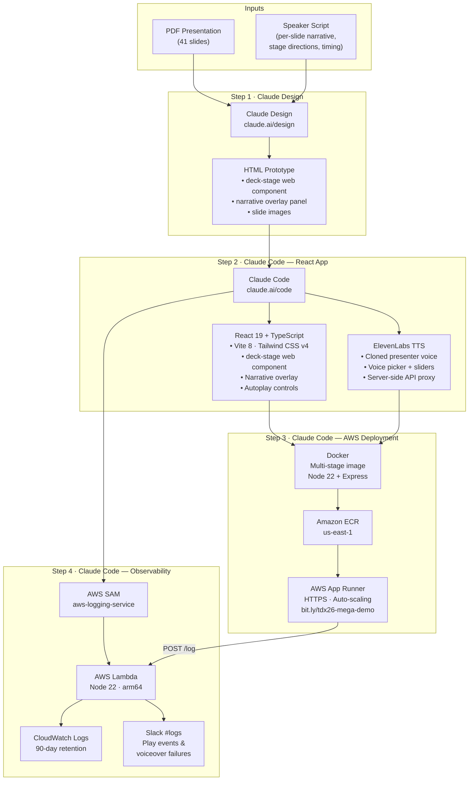
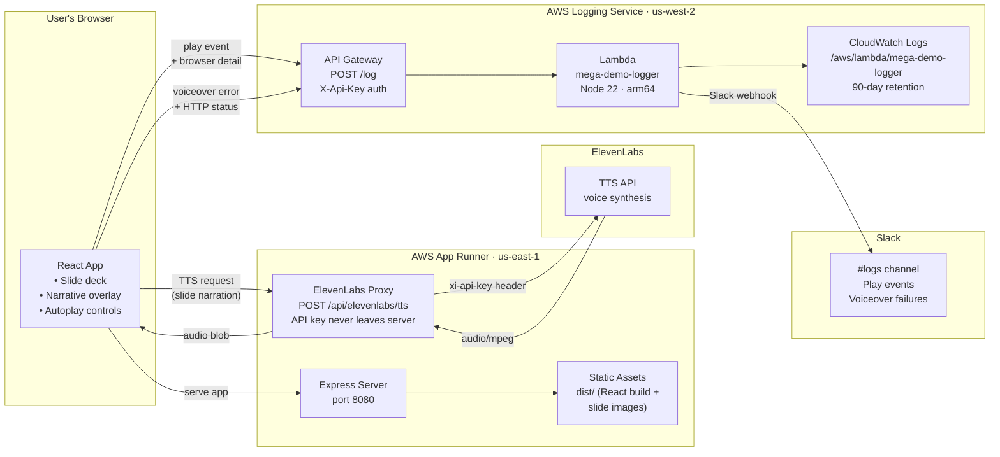

# TDX '26 — System of Context Mega Demo

An interactive, self-narrating slide deck web app for the TDX '26 Data 360 Campground Super Demo — built with AI tooling and deployed to AWS.

**Watch it live:** [bit.ly/tdx26-mega-demo](https://bit.ly/tdx26-mega-demo)

## Resources

| Resource | Link |
|----------|------|
| Live presentation | [bit.ly/tdx26-mega-demo](https://bit.ly/tdx26-mega-demo) |
| This repo (voice-over app) | [github.com/congmingwudi/tdx26-mega-demo](https://github.com/congmingwudi/tdx26-mega-demo) |
| Glucose monitor simulator | [github.com/congmingwudi/patient360-glucose-monitor](https://github.com/congmingwudi/patient360-glucose-monitor) |
| Presentation PDF | [TDX '26 - System of Context Mega Demo (April 2026).pdf](docs/TDX%20'26%20-%20System%20of%20Context%20Mega%20Demo%20(April%202026).pdf) |
| Created by Ryan Cox | [linkedin.com/in/tadryancox](https://linkedin.com/in/tadryancox) |

## What this project demonstrates

This project showcases a workflow that takes a static presentation and transforms it into a fully interactive, narrated web application — using **Claude Design** for visual prototyping and **Claude Code** for implementation and deployment.

### The build process

1. **Presentation to interactive prototype (Claude Design)**
   - Started with an existing PDF presentation covering the TDX '26 System of Context demo — a healthcare scenario showing real-time glucose monitoring, Agentforce agents, MCP servers, and governed patient data across Salesforce, Informatica, MuleSoft, and Tableau.
   - Uploaded the PDF to [Claude Design](https://claude.ai/design) along with the speaker use case document containing per-slide narrative scripts, stage directions, timing cues, and speaker assignments.
   - Claude Design merged these inputs into an HTML slide show with a `<deck-stage>` web component (keyboard/tap navigation, auto-scaling, print layout) and a floating narrative overlay panel showing phase, beat, speaker lines, and stage directions for each slide.
   - Exported the result as a handoff bundle (HTML, CSS, JS, rendered slide images, and a README for coding agents).

2. **Prototype to production React app (Claude Code)**
   - Brought the Claude Design handoff bundle into Claude Code, which read the README and all source files to understand the prototype's structure.
   - Recreated the design in React 19 + TypeScript + Tailwind CSS v4, keeping the `<deck-stage>` web component and converting the narrative overlay into a React component with structured TypeScript data.
   - Added **autoplay controls** with play/pause and mute/unmute.
   - Added **text-to-speech voiceover** powered by **ElevenLabs** — reads the "say" sections from the narrative data aloud on each slide using high-quality AI voices. The default voice is **"Ryan"**, a clone of the presenter's own voice, so the deck narrates itself in his voice. Users can choose from any voice in the ElevenLabs library via the built-in voice picker, with stability and clarity sliders for fine-tuning.
   - The ElevenLabs API key is kept server-side behind an Express proxy — it never reaches the browser. When voiceover is active, slides auto-advance when speech finishes rather than on a fixed timer.

3. **Containerized deployment to AWS (Claude Code)**
   - Packaged the app in a multi-stage Docker image (Node 22 build + Express server proxying the ElevenLabs API and serving the static frontend on port 8080).
   - Pushed the image to Amazon ECR and deployed to AWS App Runner with HTTPS, auto-scaling, and a public URL — all from the CLI without leaving the conversation.
   - The ElevenLabs API key is passed as an environment variable to the container at deploy time.

4. **Observability via serverless logging service (Claude Code)**
   - Built a companion AWS SAM project ([aws-logging-service](https://github.com/congmingwudi/aws-logging-service)) — a Lambda + API Gateway endpoint that receives structured log events from the app, writes them to CloudWatch Logs (90-day retention), and posts Slack notifications to a dedicated `#logs` channel.
   - The app sends a **play event** each time a user starts the presentation, capturing browser, language, timezone, screen resolution, and referrer.
   - Any **voiceover failure** (ElevenLabs API error, quota exhaustion, audio playback blocked) is logged and posted to Slack in real time. The UI simultaneously disables the voice button and shows a "Voiceover unavailable · refresh to retry" banner so the presenter is never left wondering why narration stopped.

## Presentation app — build flow

How the presentation web app was constructed, from raw inputs to deployed product:



## Presentation app — runtime architecture

How the deployed app handles a user session end-to-end:



## Solution architecture

The demo walks through a healthcare scenario where a patient's glucose monitor triggers an end-to-end workflow across multiple Salesforce and partner systems.

### System of Context Platform

The full platform view — source systems (EHR, pharmacy, wearables) flow through MuleSoft, Informatica MDM, Data 360, and Tableau Next into Agentforce and Slack. Trusted Services provide the governance foundation.


### Real-Time Events — Care Agent Flow

Glucose monitor events stream through Data 360's real-time data graph into the Care Agent, which generates Slack alerts, schedules appointments, and updates the EHR via the Patient 360 MCP Server.


### Semantic Model — Analytics Agent Flow

Data 360's semantic model grounds Tableau Next dashboards and the Analytics Agent, ensuring agent responses are based on clinically certified metric definitions rather than raw database fields.


### Data 360 Agent — Segmentation & Activation Flow

The Data 360 Agent composes segment rules from the real-time data graph. Segments feed Marketing Cloud Next for activation-triggered patient outreach.


## Demo tech stack (Salesforce + partners)

The healthcare scenario showcased in the presentation runs on:

- **Salesforce Platform** — Health Cloud Patient 360 Console, Flow Builder, Shield Platform Encryption, Privacy Center
- **Agentforce** — Care Agent with Agent Script, Agentforce Builder, Agentforce Registry with MCP client support
- **Data 360** — Real-Time Data Graph, Data Model Objects, Data Governance (PHI/HIPAA tagging), Semantic Model Builder, D360 Agent for segmentation
- **Slack** — #care-alerts channel, Care Agent conversational actions, Slackbot cross-system queries, human-in-the-loop approval
- **Tableau Next** — Patient 360 dashboards grounded by semantic models, Analytics & Visualization Agent
- **Marketing Cloud Next** — Activation-triggered patient outreach flows driven by Data 360 segments
- **MuleSoft** — Patient 360 MCP Server published on MuleSoft Exchange, providing governed tools (get_patient_record, update_patient_record, etc.) to Agentforce agents
- **Informatica** — Customer 360 MDM for patient golden record resolution across EHR, Epic, IQVIA, and other source systems

## Presentation app tech stack

The voice-over web app itself is built with:

- **Frontend**: React 19, TypeScript, Vite 8, Tailwind CSS v4, React Router v7
- **Slide engine**: `<deck-stage>` custom element — keyboard/tap navigation, viewport scaling, localStorage persistence, print layout
- **Voiceover**: ElevenLabs TTS API via server-side Express proxy, with presenter's cloned voice as default
- **Deployment**: Docker (Node 22 + Express), Amazon ECR, AWS App Runner

## Running locally

```bash
npm install
npm run dev         # http://localhost:5173
```

Note: The rendered slide images (`public/rendered/page-*.jpg`) are not checked into git due to size. They are sourced from the Claude Design export bundle and must be present locally for the slides to display. The Docker build copies them from the local filesystem.

## Keyboard shortcuts

| Key | Action |
|-----|--------|
| `←` `→` `Space` `PgUp` `PgDn` | Navigate slides |
| `Home` / `End` | First / last slide |
| `1`–`9`, `0` | Jump to slide 1–10 |
| `R` | Reset to slide 1 |
| `N` | Toggle narrative overlay |
| `M` | Mute / unmute voiceover |

## Deploying

```bash
# Build and push container (use a versioned tag — :latest is cached by App Runner)
TAG="v$(date +%Y%m%d-%H%M%S)"
docker build --platform linux/amd64 -t mega-demo .
aws ecr get-login-password --region us-east-1 | docker login --username AWS --password-stdin 730335577398.dkr.ecr.us-east-1.amazonaws.com
docker tag mega-demo:latest 730335577398.dkr.ecr.us-east-1.amazonaws.com/mega-demo:$TAG
docker push 730335577398.dkr.ecr.us-east-1.amazonaws.com/mega-demo:$TAG

# Update App Runner to the new versioned image
aws apprunner update-service \
  --region us-east-1 \
  --service-arn arn:aws:apprunner:us-east-1:730335577398:service/mega-demo/1715cd08ce1248c4aced5d4fb4b98efd \
  --source-configuration "{\"ImageRepository\":{\"ImageIdentifier\":\"730335577398.dkr.ecr.us-east-1.amazonaws.com/mega-demo:$TAG\",\"ImageRepositoryType\":\"ECR\"}}"
```

The logging service is a separate SAM project — see [aws-logging-service](https://github.com/congmingwudi/aws-logging-service) for its own deploy instructions.

## AI tools used across the solution

This demo is itself a showcase of AI-assisted development. Every component — from the healthcare simulation to the presentation you're watching — was built or accelerated by AI tooling:

| Component | AI Tool | What it did |
|-----------|---------|-------------|
| **Glucose monitor simulator** | [Claude Code](https://claude.ai/code) | Built the real-time WebSocket app that streams glucose readings into the Data 360 Real-Time Data Graph |
| **Patient record page** | [MeshMesh](https://meshmesh.io) | Designed the Health Cloud patient record page and related objects in one visual surface, verifying the Data 360 schema before wiring it to agents |
| **Tableau dashboard data** | [Cursor](https://cursor.com) | Generated realistic healthcare data (patient encounters, CSAT scores, clinical metrics) shaped to match the semantic model |
| **Presentation web app** | [Claude Design](https://claude.ai/design) + [Claude Code](https://claude.ai/code) | Claude Design prototyped the slide deck with narrative overlay; Claude Code converted it to a React app with ElevenLabs voiceover, autoplay, and deployed it to AWS |
| **Voiceover narration** | [ElevenLabs](https://elevenlabs.io) | The default voice is a clone of the presenter's own voice — the demo literally narrates itself |
| **AWS deployment** | [Claude Code](https://claude.ai/code) | Dockerized the app, pushed to ECR, and deployed to App Runner — all from the CLI in conversation |
| **Logging & alerting** | [Claude Code](https://claude.ai/code) | Built a serverless Lambda logging API (SAM) that forwards play events and voiceover errors to CloudWatch and Slack `#logs` in real time |
