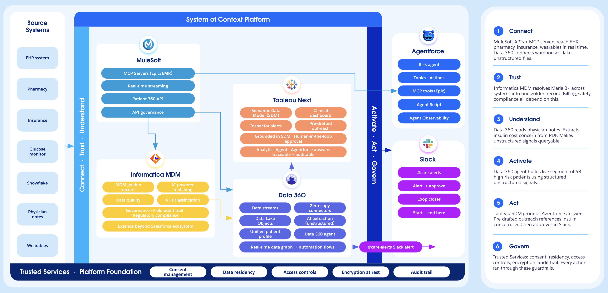
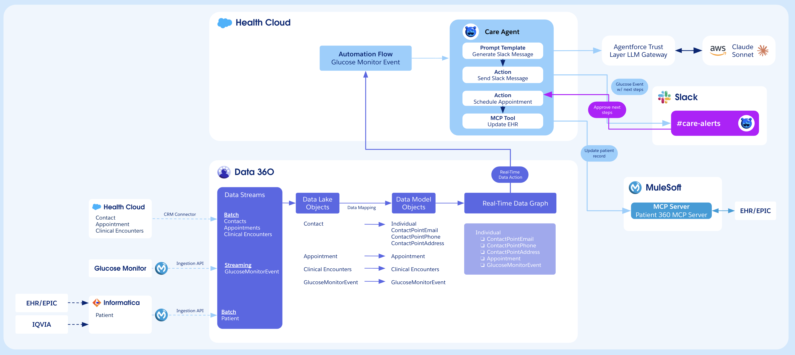
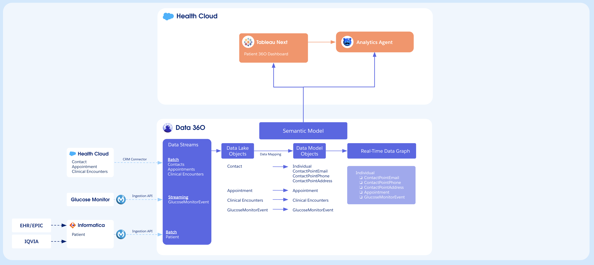
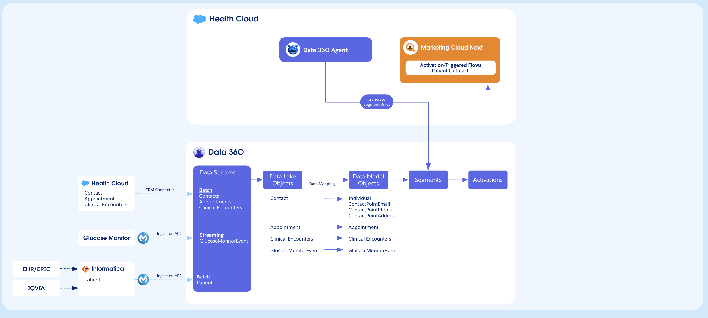

# TDX '26 — System of Context Mega Demo

An interactive slide deck web app for the TDX '26 Data 360 Campground Super Demo, built entirely with Claude's AI toolchain and deployed to AWS.

## What this project demonstrates

This project showcases a workflow that takes a static presentation and transforms it into a fully interactive, narrated web application — using **Claude Design** for visual prototyping and **Claude Code** for implementation and deployment.

### The build process

1. **Presentation to interactive prototype (Claude Design)**
   - Started with an existing 33-slide PDF presentation covering the TDX '26 System of Context demo — a healthcare scenario showing real-time glucose monitoring, Agentforce agents, MCP servers, and governed patient data across Salesforce, Informatica, MuleSoft, and Tableau.
   - Uploaded the PDF to [Claude Design](https://claude.ai/design) along with the speaker use case document containing per-slide narrative scripts, stage directions, timing cues, and speaker assignments.
   - Claude Design merged these inputs into an HTML slide show with a `<deck-stage>` web component (keyboard/tap navigation, auto-scaling, print layout) and a floating narrative overlay panel showing phase, beat, speaker lines, and stage directions for each slide.
   - Exported the result as a handoff bundle (HTML, CSS, JS, rendered slide images, and a README for coding agents).

2. **Prototype to production React app (Claude Code)**
   - Brought the Claude Design handoff bundle into Claude Code, which read the README and all source files to understand the prototype's structure.
   - Recreated the design in React 19 + TypeScript + Tailwind CSS v4, keeping the `<deck-stage>` web component and converting the narrative overlay into a React component with structured TypeScript data.
   - Added **autoplay controls** with adjustable timing (1s–30s per slide) and play/pause.
   - Added **text-to-speech voiceover** powered by **ElevenLabs** — reads the "say" sections from the narrative data aloud on each slide using high-quality AI voices. The default voice is **"Ryan"**, a clone of the presenter's own voice, so the deck narrates itself in his voice. Users can choose from any voice in the ElevenLabs library via the built-in voice picker, with stability and clarity sliders for fine-tuning.
   - The ElevenLabs API key is kept server-side behind an Express proxy — it never reaches the browser. When voiceover is active, slides auto-advance when speech finishes rather than on a fixed timer.

3. **Containerized deployment to AWS (Claude Code)**
   - Packaged the app in a multi-stage Docker image (Node 22 build + Express server proxying the ElevenLabs API and serving the static frontend on port 8080).
   - Pushed the image to Amazon ECR and deployed to AWS App Runner with HTTPS, auto-scaling, and a public URL — all from the CLI without leaving the conversation.
   - The ElevenLabs API key is passed as an environment variable to the container at deploy time.

## Solution architecture

The demo walks through a healthcare scenario where a patient's glucose monitor triggers an end-to-end workflow across multiple Salesforce and partner systems.

### System of Context Platform

The full platform view — source systems (EHR, pharmacy, wearables) flow through MuleSoft, Informatica MDM, Data 360, and Tableau Next into Agentforce and Slack. Trusted Services provide the governance foundation.



### Real-Time Events — Care Agent Flow

Glucose monitor events stream through Data 360's real-time data graph into the Care Agent, which generates Slack alerts, schedules appointments, and updates the EHR via the Patient 360 MCP Server.



### Semantic Model — Analytics Agent Flow

Data 360's semantic model grounds Tableau Next dashboards and the Analytics Agent, ensuring agent responses are based on clinically certified metric definitions rather than raw database fields.



### Data 360 Agent — Segmentation & Activation Flow

The Data 360 Agent composes segment rules from the real-time data graph. Segments feed Marketing Cloud Next for activation-triggered patient outreach.



## Tech stack

- **Frontend**: React 19, TypeScript, Vite 8, Tailwind CSS v4, React Router v7
- **Slide engine**: `<deck-stage>` custom element — keyboard/tap navigation, viewport scaling, localStorage persistence, print layout
- **Voiceover**: ElevenLabs TTS API via server-side proxy (Express), with presenter's cloned voice as default
- **Deployment**: Docker (Node 22 + Express), Amazon ECR, AWS App Runner

## Running locally

```bash
npm install
npm run dev         # http://localhost:5173
```

Note: The rendered slide images (`public/rendered/page-*.jpg`) are not checked into git due to size. They are sourced from the Claude Design export bundle and must be present locally for the slides to display. The Docker build copies them from the local filesystem.

## Keyboard shortcuts

| Key | Action |
|-----|--------|
| `←` `→` `Space` `PgUp` `PgDn` | Navigate slides |
| `Home` / `End` | First / last slide |
| `1`–`9`, `0` | Jump to slide 1–10 |
| `R` | Reset to slide 1 |
| `N` | Toggle narrative overlay |
| `V` | Toggle voiceover |

## Deploying

```bash
# Build and push container
docker build --platform linux/amd64 -t mega-demo .
aws ecr get-login-password --region us-east-1 | docker login --username AWS --password-stdin <account-id>.dkr.ecr.us-east-1.amazonaws.com
docker tag mega-demo:latest <account-id>.dkr.ecr.us-east-1.amazonaws.com/mega-demo:latest
docker push <account-id>.dkr.ecr.us-east-1.amazonaws.com/mega-demo:latest

# Trigger App Runner redeployment
aws apprunner start-deployment --service-arn <service-arn> --region us-east-1
```

## Tools used

- [Claude Design](https://claude.ai/design) — visual prototyping and handoff bundle generation
- [Claude Code](https://claude.ai/code) — implementation, iteration, and deployment
